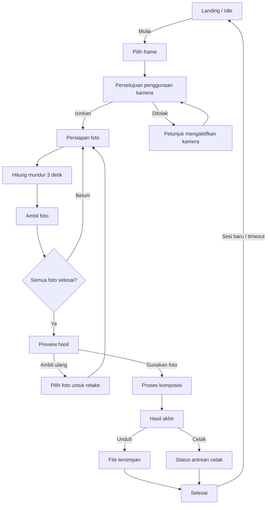
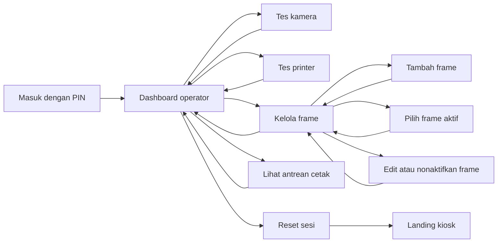

# Alur Aplikasi Photobooth iPad TOBFest

Dokumen ini menjadi acuan UX dan implementasi untuk aplikasi photobooth berbasis web/PWA yang digunakan langsung di lokasi acara. Satu atau beberapa iPad ditempatkan sebagai kiosk agar pengunjung dapat memilih frame dan mengambil foto secara mandiri di tempat.

## 1. Tujuan Produk

Aplikasi membantu pengunjung untuk:

- memulai sesi photobooth dengan cepat;
- mengambil beberapa foto menggunakan kamera perangkat;
- memilih frame atau template;
- meninjau dan mengulang foto jika diperlukan;
- menyimpan, mengunduh, dan mencetak hasil foto;
- menyelesaikan sesi tanpa meninggalkan data pribadi di layar kiosk.

Aplikasi dirancang untuk penggunaan di lapangan: layar sentuh, sesi singkat, antrean pengunjung, koneksi internet yang mungkin tidak stabil, dan perangkat yang terus aktif selama acara.

## 2. Aktor

### Pengunjung

Pengguna utama yang mengambil foto dan menerima hasilnya. Login bersifat opsional agar antrean tetap cepat.

### Operator

Petugas yang menyiapkan iPad, memeriksa kamera dan printer, menambahkan frame, memilih frame yang aktif, serta membantu ketika terjadi gangguan.

### Admin

Pengelola konfigurasi acara, aset frame, batas cetak, dan riwayat sesi. Untuk MVP, peran operator dan admin dapat digabungkan.

## 3. Ruang Lingkup MVP

- Mode kiosk layar penuh.
- Tampilan responsif untuk iPad dalam orientasi portrait atau landscape yang ditentukan operator.
- Akses kamera depan iPad dan pratinjau secara langsung.
- Operator dapat menambahkan dan mengelola frame.
- Pengunjung dapat memilih frame dari daftar frame yang diaktifkan operator.
- Pengambilan foto dengan hitung mundur; jumlah foto mengikuti jumlah slot layout frame terpilih.
- Pilihan layout strip dapat memiliki dua, tiga, atau jumlah slot lain. Kamera menyediakan rasio `4:5`, `1:1`, dan `5:4`, sementara ukuran area foto dapat di-resize bebas oleh operator.
- Retake per foto sebelum finalisasi.
- Komposisi foto menjadi satu hasil akhir.
- Simpan sesi secara lokal agar tetap berfungsi saat internet tidak stabil.
- Unduh hasil sebagai gambar.
- Cetak hasil jika printer tersedia.
- QR code untuk mengambil hasil di perangkat pribadi dapat ditambahkan setelah MVP.

### Penggunaan di lokasi

1. Operator memasang iPad pada stand dan membuka aplikasi dalam mode kiosk/Guided Access.
2. Operator masuk ke dashboard menggunakan PIN.
3. Operator menguji kamera, mengatur orientasi layar, lalu menambahkan atau memilih frame untuk acara.
4. Operator mengaktifkan mode pengunjung.
5. Setiap pengunjung memilih frame, mengambil foto sesuai jumlah slot, menerima hasil, lalu aplikasi otomatis kembali ke landing untuk pengunjung berikutnya.
6. Jika koneksi terputus, sesi tetap berjalan menggunakan aset dan penyimpanan lokal di iPad.

## 4. Alur Utama Pengunjung



### Happy path

1. Pengunjung melihat landing screen dan menekan **Mulai Foto**.
2. Pengunjung memilih satu frame/template.
3. Aplikasi meminta izin kamera jika izin belum tersedia.
4. Aplikasi menampilkan posisi kamera dan instruksi singkat.
5. Setelah tombol **Ambil Foto** ditekan, aplikasi menjalankan hitung mundur 3 detik.
6. Foto diambil sesuai jumlah slot pada frame dengan jeda singkat di antara pengambilan.
7. Pengunjung melihat preview seluruh foto dengan frame terpilih.
8. Pengunjung memilih **Gunakan Foto Ini** atau mengambil ulang salah satu foto.
9. Aplikasi menggabungkan foto dengan frame terpilih.
10. Pengunjung mengunduh dan/atau mencetak hasil.
11. Pengunjung menekan **Selesai**, atau sesi diakhiri otomatis setelah timeout.
12. Aplikasi menghapus tampilan dan data sesi aktif, lalu kembali ke landing screen.

## 5. Detail Tiap Layar

### 5.1 Landing / Idle

**Tujuan:** menarik perhatian dan memulai sesi baru.

**Konten:**

- logo dan nama acara;
- contoh hasil photobooth;
- tombol utama **Mulai Foto**;
- teks singkat mengenai jumlah foto dan estimasi waktu;
- indikator kamera/printer untuk operator, tanpa mengganggu pengunjung.

**Perilaku:**

- animasi idle boleh diputar ketika tidak ada interaksi;
- menekan layar atau tombol utama membuat `sessionId` baru;
- sesi lama yang belum selesai dibersihkan sebelum sesi baru dimulai.

### 5.2 Izin Kamera

**Tujuan:** memastikan aplikasi dapat menggunakan kamera.

**Konten:** alasan izin kamera dibutuhkan dan tombol **Izinkan Kamera**.

**State:**

- `prompt`: tampilkan tombol permintaan izin;
- `granted`: lanjut otomatis ke layar kamera;
- `denied`: tampilkan petunjuk membuka pengaturan browser;
- `unavailable`: tampilkan pesan bahwa kamera tidak ditemukan dan tombol panggil operator.

### 5.3 Pilih Frame

**Tujuan:** memilih desain hasil foto.

**Konten:** thumbnail frame, nama frame, status pilihan, tombol **Lanjut**.

**Aturan:**

- hanya satu frame dapat dipilih;
- frame pertama boleh dipilih sebagai default;
- tombol **Lanjut** aktif setelah frame siap dimuat;
- aset frame harus tersedia secara lokal untuk mendukung mode offline.
- hanya frame berstatus **Aktif** yang terlihat oleh pengunjung;
- pilihan frame disimpan pada sesi dan diterapkan ke preview serta hasil final;
- jika hanya ada satu frame aktif, operator dapat mengatur aplikasi untuk memilihnya otomatis dan melewati layar ini.

### 5.4 Kamera / Capture

**Tujuan:** mengambil foto dengan komposisi dan timing yang konsisten.

**Konten:**

- live camera preview;
- Live Photo untuk setiap slot: foto diam resolusi tinggi dan klip 4 detik, terdiri dari 2 detik sebelum serta 2 detik sesudah shutter;
- panduan posisi wajah/tubuh;
- progres, misalnya `Foto 1 dari 4`;
- tombol **Ambil Foto**;
- tombol kembali hanya sebelum rangkaian foto dimulai.

**Urutan capture:**

1. Kunci tombol agar tidak dapat ditekan dua kali.
2. Jalankan hitung mundur `3 → 2 → 1`.
3. Tampilkan flash visual dan ambil frame kamera.
4. Simpan foto diam pada titik tengah rekaman Live Photo.
5. Lanjutkan rekaman selama 2 detik setelah shutter, lalu simpan klip bersama slot foto.
6. Jika perekaman video tidak didukung browser, lanjutkan alur menggunakan foto diam.
7. Simpan hasil sementara ke sesi lokal.
8. Ulangi hingga jumlah foto terpenuhi.

### 5.5 Review Foto

**Tujuan:** memastikan pengunjung puas sebelum hasil dirender.

**Konten:** seluruh foto, frame terpilih, tombol **Ambil Ulang**, dan tombol **Gunakan Foto Ini**.

**Aturan:**

- retake mengganti foto pada slot yang dipilih;
- maksimal retake dapat dibatasi, misalnya 2 kali per slot, untuk menjaga antrean;
- frame tidak dapat diganti pada tahap review karena jumlah foto sudah mengikuti layout yang dipilih;
- tampilkan konfirmasi sebelum keluar dan menghapus sesi.

### 5.6 Processing

**Tujuan:** memberi umpan balik saat aplikasi menyusun hasil final.

**Konten:** loading indicator dan teks **Sedang menyiapkan fotomu...**.

**Aturan:**

- interaksi dinonaktifkan selama proses render;
- jangan berpindah layar sebelum file akhir berhasil dibuat;
- bila render gagal, pertahankan foto mentah dan sediakan tombol **Coba Lagi**.

### 5.7 Hasil Akhir

**Tujuan:** menyerahkan hasil kepada pengunjung.

**Konten:** preview resolusi tinggi, tombol **QR**, dan **Selesai**. Setelah QR dipindai, ponsel menampilkan dua pilihan: **Foto JPG** dan **Live MP4**. Ketika **Mulai lagi** ditekan, QR dinonaktifkan dan kedua file dihapus. Batas 24 jam menjadi pengaman jika sesi tidak ditutup normal.

**Aturan:**

- nama file: `tobfest-{sessionId}-{timestamp}.jpg`;
- tombol cetak hanya aktif jika layanan printer siap;
- cegah klik cetak berulang selama job sedang dikirim;
- setelah berhasil, tampilkan status yang jelas: diunduh, masuk antrean cetak, atau gagal;
- tombol **Selesai** menampilkan konfirmasi jika hasil belum diunduh atau dicetak.

### 5.8 Selesai

**Tujuan:** mengakhiri sesi dengan aman.

**Konten:** ucapan terima kasih dan hitung mundur kembali ke landing.

**Perilaku:**

- kembali otomatis ke landing dalam 5–10 detik;
- hapus foto dari state aktif dan memory URL;
- simpan hanya metadata operasional yang dibutuhkan;
- jangan menampilkan hasil pengguna sebelumnya pada sesi berikutnya.

## 6. Login dan Identitas Pengguna

Untuk kiosk acara, login tidak diwajibkan pada alur utama karena menambah waktu antrean. Jika identitas diperlukan, gunakan salah satu opsi berikut setelah hasil selesai:

- input email/nomor telepon secara opsional untuk menerima tautan;
- scan QR code unik tanpa login;
- login admin/operator melalui halaman terpisah dan PIN.

Data kontak tidak boleh disimpan lebih lama dari kebutuhan pengiriman hasil dan harus disertai persetujuan pengguna.

## 7. Alur Operator



Dashboard operator dapat dibuka melalui shortcut yang tidak terlihat pada alur pengunjung, misalnya menekan logo lima kali lalu memasukkan PIN.

### 7.1 Tambah Frame

**Tujuan:** menambahkan desain frame baru yang akan dipakai pada acara.

**Input:**

- nama frame;
- file frame berformat PNG; transparansi awal tidak diwajibkan;
- thumbnail preview, dibuat otomatis dari file frame;
- hasil template dinormalisasi ke strip portrait `600 × 1800 px`, sedangkan ukuran PNG sumber bebas;
- status **Aktif/Tidak Aktif**;
- urutan tampilan pada layar pemilihan frame.

**Alur:**

1. Operator membuka **Dashboard → Kelola Frame**.
2. Operator menekan **Tambah Frame**.
3. Operator memilih file PNG dari penyimpanan iPad atau file picker.
4. Aplikasi memvalidasi format dan ukuran file.
5. Operator menambahkan 1–6 area foto di atas preview PNG.
6. Operator menggeser, memperbesar, mengatur radius sudut, dan menentukan urutan area.
7. Operator dapat mengaktifkan **Snap** untuk mengunci koordinat ke grid 20 px atau mematikannya untuk posisi bebas.
8. Preview hasil tanpa garis bantu diperbarui langsung di samping editor.
9. Operator mengisi nama dan status frame, lalu menekan **Simpan Frame**.
10. Frame disimpan ke IndexedDB dan tersedia secara offline pada iPad.

**Validasi:**

- menerima PNG dengan ukuran dan transparansi apa pun; area foto ditentukan operator melalui editor visual;
- area yang ditandai otomatis dilubangi pada overlay dan dapat di-resize bebas tanpa dikunci ke rasio tertentu;
- editor mendukung `Ctrl/Cmd+C`, `Ctrl/Cmd+V`, `Ctrl/Cmd+Z`, serta tombol `Shift` saat drag/resize untuk penyesuaian presisi 1 px;
- radius sudut setiap area diterapkan identik pada preview, JPG, dan MP4;
- ukuran file maksimum ditentukan melalui konfigurasi, misalnya 10 MB;
- nama frame wajib diisi dan tidak boleh duplikat;
- frame yang tidak valid tidak boleh diaktifkan.

### 7.2 Pilih dan Kelola Frame Aktif

**Tujuan:** menentukan frame yang dapat dipilih oleh pengunjung.

**Kemampuan operator:**

- melihat daftar dan preview seluruh frame;
- mengaktifkan atau menonaktifkan frame;
- memilih satu frame sebagai default;
- mengubah urutan frame dengan drag-and-drop atau tombol naik/turun;
- mengedit nama dan orientasi frame;
- menghapus frame yang tidak sedang digunakan oleh sesi aktif;
- melakukan preview frame dengan kamera sebelum mode pengunjung dibuka.

Minimal satu frame harus aktif sebelum kiosk masuk ke mode pengunjung. Jika seluruh frame dinonaktifkan, aplikasi menahan mode kiosk dan meminta operator memilih frame.

## 8. State Sesi

```ts
type BoothSessionStatus =
  | 'idle'
  | 'selecting-frame'
  | 'capturing'
  | 'reviewing'
  | 'processing'
  | 'completed'
  | 'cancelled'
  | 'failed'

type BoothSession = {
  id: string
  status: BoothSessionStatus
  frameId: string | null
  photos: Array<{
    slot: number
    blob: Blob
    retakeCount: number
  }>
  finalImage: Blob | null
  printStatus: 'not-requested' | 'queued' | 'printing' | 'printed' | 'failed'
  createdAt: string
  completedAt: string | null
}
```

```ts
type PhotoFrame = {
  id: string
  name: string
  imageBlob: Blob
  thumbnailBlob: Blob
  orientation: 'portrait'
  width: number
  height: number
  isActive: boolean
  isDefault: boolean
  sortOrder: number
  createdAt: string
  updatedAt: string
}
```

Foto mentah, hasil final, dan aset frame dapat disimpan menggunakan IndexedDB/Dexie. Foto sesi dibersihkan setelah batas waktu tertentu, sedangkan frame tetap tersimpan sampai dihapus oleh operator. State UI tetap berada di React agar perubahan layar responsif.

## 9. Error dan Recovery

| Kondisi | Respons aplikasi |
| --- | --- |
| Izin kamera ditolak | Tampilkan cara mengaktifkan izin dan tombol coba lagi. |
| Kamera tidak ditemukan | Tampilkan status perangkat dan tombol panggil operator. |
| Kamera terputus saat sesi | Pertahankan foto yang sudah ada dan coba sambungkan ulang. |
| Render hasil gagal | Simpan foto mentah, tampilkan **Coba Lagi**, dan catat error. |
| Printer offline | Nonaktifkan **Cetak**, tetapi tetap izinkan unduh. |
| Cetak gagal | Pertahankan job untuk dicoba ulang oleh operator. |
| Koneksi internet putus | Lanjutkan capture, render, dan penyimpanan secara lokal. |
| Aplikasi dimuat ulang | Pulihkan sesi lokal yang belum kedaluwarsa atau reset dengan konfirmasi operator. |
| Tidak ada aktivitas | Tampilkan peringatan, lalu hapus sesi dan kembali ke landing. |
| Penyimpanan penuh | Hentikan sesi baru, bersihkan data kedaluwarsa, dan beri tahu operator. |
| File frame tidak valid | Tolak file, jelaskan validasi yang gagal, dan pertahankan form operator. |
| Frame aktif gagal dimuat | Sembunyikan frame dari pengunjung dan beri peringatan pada operator. |
| iPad berpindah orientasi | Kunci layout sesuai konfigurasi atau minta operator mengembalikan orientasi. |

## 10. Aturan Timeout

- Landing: tidak ada timeout sesi.
- Pilih frame: peringatan setelah 60 detik tanpa aktivitas.
- Capture/review: peringatan setelah 90 detik tanpa aktivitas.
- Hasil akhir: kembali ke landing setelah 60 detik tanpa aktivitas.
- Peringatan timeout memberi waktu 10 detik untuk menekan **Lanjutkan Sesi**.

Nilai timeout harus dapat diubah dari konfigurasi acara.

## 11. Privasi dan Penyimpanan

- Tampilkan persetujuan singkat sebelum kamera digunakan.
- Jangan mengunggah foto tanpa persetujuan eksplisit.
- Hapus object URL dan data sesi aktif setelah selesai.
- Bersihkan foto lokal secara berkala, misalnya setelah 24 jam atau setelah hasil berhasil dikirim.
- Jangan menaruh data sensitif di log aplikasi.
- Sediakan tindakan operator untuk menghapus seluruh data lokal setelah acara.

## 12. Kriteria Selesai MVP

- Pengunjung dapat menyelesaikan alur dari landing hingga unduh tanpa login.
- Kamera meminta izin dan menampilkan pesan yang tepat untuk setiap status izin.
- Aplikasi mengambil jumlah foto yang tepat sesuai jumlah slot frame terpilih.
- Setiap slot foto dapat di-retake tanpa menghapus slot lain.
- Frame terpilih muncul pada hasil final.
- Perubahan layout frame langsung terlihat pada editor dan identik dengan hasil JPG serta MP4.
- Hasil unduhan menggunakan kanvas 4R portrait (`1200 × 1800 px`) berisi dua strip identik `600 × 1800 px`; jumlah dan ukuran area foto mengikuti layout frame.
- Posisi setiap foto dapat digeser dan diperbesar sebelum hasil akhir dibuat.
- Hasil dapat diunduh sebagai JPG atau PNG dengan resolusi cetak yang memadai.
- Kegagalan printer tidak menghalangi pengguna mengunduh hasil.
- Sesi sebelumnya tidak terlihat setelah kembali ke landing.
- Alur capture dan render utama tetap berjalan tanpa koneksi internet.
- Seluruh tombol utama mudah digunakan pada layar sentuh dan memiliki state loading/disabled yang jelas.
- Operator dapat menambahkan PNG dengan ukuran bebas dari iPad dan melihat preview sebelum menyimpan.
- Operator dapat membuat 1–6 area foto secara manual, menggeser dan mengubah ukurannya, serta menentukan urutan pengambilan foto.
- Operator dapat mengatur radius sudut per area dan mengaktifkan atau menonaktifkan snap grid 20 px.
- Aplikasi hanya menyediakan Double Feature dua foto sebagai frame bawaan; preset bawaan lama dibersihkan tanpa menghapus frame unggahan operator.
- Operator dapat mengaktifkan, menonaktifkan, mengurutkan, dan memilih frame default.
- Pengunjung hanya melihat frame aktif dan frame pilihannya digunakan pada hasil final.
- Aplikasi dapat menyelesaikan beberapa sesi pengunjung secara berurutan pada iPad tanpa memperlihatkan hasil sesi sebelumnya.

## 13. Urutan Implementasi

1. Buat state machine dan navigasi layar.
2. Implementasikan izin kamera dan live preview.
3. Implementasikan countdown, capture, dan retake.
4. Tambahkan data frame, unggah PNG, dan pengelolaan frame dari dashboard operator.
5. Tambahkan pilihan frame pengunjung dan komposisi hasil menggunakan canvas.
6. Tambahkan penyimpanan sesi serta aset frame lokal dengan Dexie.
7. Tambahkan unduh hasil dan integrasi printer.
8. Tambahkan timeout, reset sesi, dan error recovery.
9. Tambahkan mode kiosk serta pengaturan orientasi iPad.
10. Uji alur penuh pada iPad, kamera depan, dan printer sebenarnya di lokasi acara.

Fitur di luar scope dapat ditambahkan setelah alur capture, render, unduh, dan cetak terbukti stabil di perangkat acara.
